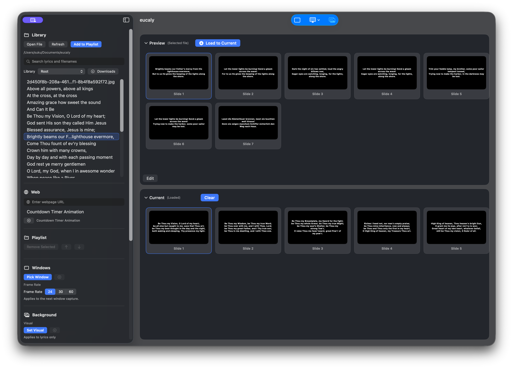

# eucaly

`eucaly` is a macOS presentation app for churches and teams that need reliable projection of lyrics and media.

Core interaction model:

1. Select an item in the sidebar
2. Preview it
3. Explicitly load it into **Current**
4. Project **Current** to the display

Browsing never silently replaces **Current**.

## Features

- Lyrics presentation from `.txt`
- PDF slides
- Images
- Videos
- Background visual layer for lyrics
- Background audio layer
- Timer / clock overlay
- Live app-window capture with ScreenCaptureKit
- Webpage preview / projection
- Recursive text search under library root
- Explicit projection display selection

Webpage behavior:

- webpages are interactive in both Preview and Current
- webpage mute is intentionally independent:
  - Preview webpage mute affects Preview only
  - Current webpage mute affects Current and projection

## Screenshots

### Main Window


## Project Structure

- `eucaly/ContentView.swift`
  - app-level orchestration
- `eucaly/PresentationFlowController.swift`
  - Preview -> Current flow
- `eucaly/PresentationWindowController.swift`
  - projection runtime, layers, playback
- `eucaly/SidebarView.swift`
  - source selection UI
- `eucaly/ScreenCaptureManager.swift`
  - window capture and picker integration
- `eucaly/LibraryTextSearchIndex.swift`
  - recursive text indexing and FTS search

## Requirements

- macOS 14+
- Xcode

Notes:

- Window capture uses the system picker on supported macOS versions.
- Screen recording permission is requested lazily from explicit user action.

## Build

Run tests:

```sh
make test
```

Build a local release app:

```sh
make build
```

Build for the current machine architecture only:

```sh
make build-for-this
```

## Search

Search behavior and implementation details are documented in:

- `SEARCH.md`

## Developer Notes

The project-specific engineering and flow rules are documented in:

- `AGENTS.md`

This is the authoritative guide for:

- Preview -> Current contract
- projection layer rules
- window capture behavior
- keyboard shortcut expectations
- state-management and refactor standards
